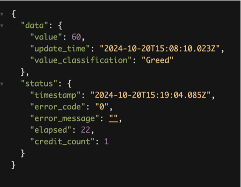

# Acurast App that acts as Fear Freed Oracle for Omnicastles

It Calls the Coinmarket cap Frear greed Index API endpoint, and gets a data that looks like this: 

it forwards that data to smart contracts

## App Runtime Environment

Acurast processors run **Node.js v18.17.1**.

It's important to ensure that any app deployed to the processors is compatible with this version of Node.js. Please make sure that your apps adhere to this requirement to ensure proper execution within the Acurast environment.

## Overview

The project is a simple [TypeScript](https://www.typescriptlang.org/) app that depends on the `ethers-js` library. It uses [webpack](https://webpack.js.org/) to transpile TypeScript to JavaScript and bundle the code with its dependencies so that it can be deployed on Acurast processors.

#### Files
- `src/index.ts`: main file

## Usage

To deploy the app:

1. Set your API endpoint in `src/index.ts` by replacing the placeholder:
```typescript
const API_KEY = 'OPENWEATHERMAP_API_KEY_HERE';
const WEATHERMAN_PK = 'WEATHERMAN_PRIVATE_KEY_HERE';
```

The app will use this wallet to send transacion to Shogun Smart Contract. - We need to make sure that this account has APT tokens for gas fees.


2. Bundle the project:
```bash
$ npm run bundle
```

3. Then we can deploy to acurast cloud 

Details here: https://docs.acurast.com/developers/deploy-first-app